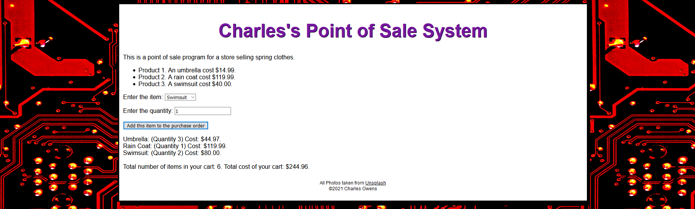

# ItemCart

## JavaScript App for adding items to a shopping cart

 User can pick an item (from a dropdown menu) and the quantity of each item.  After hitting submit, the app keeps a running total of each item's quanity and total cost.  The app also maintains the total number of items in the cart and total price.  The app also contains input validation for the quantity field.